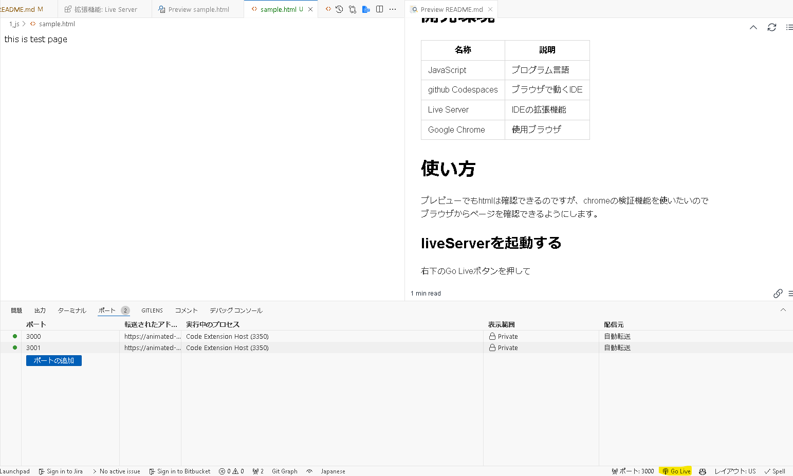
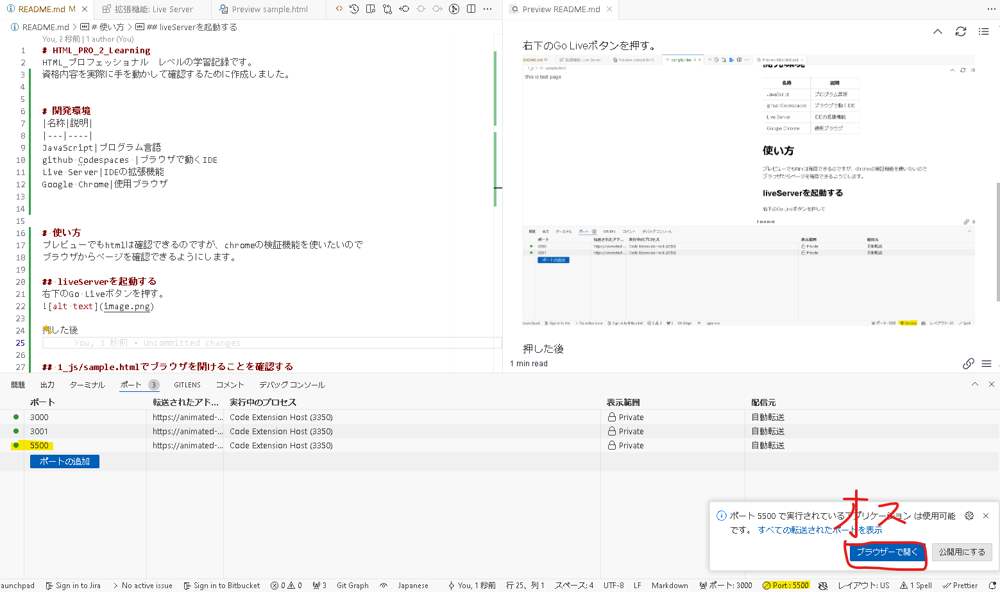
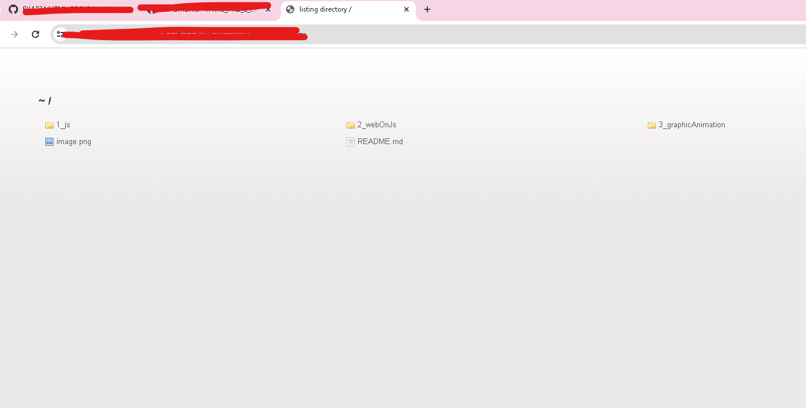
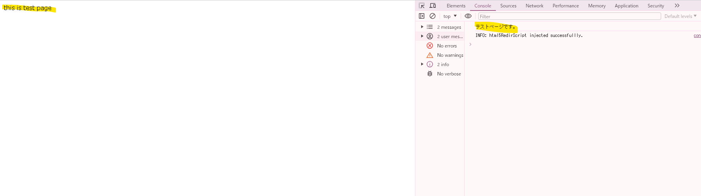

# HTML_PRO_2_Learning
HTML_プロフェッショナル　レベル2の学習記録です。
資格内容を実際に手を動かして確認するために作成しました。

# 開発環境
|名称|説明|
|---|----|
JavaScript|プログラム言語
github Codespaces |ブラウザで動くIDE
Live Server|IDEの拡張機能
Google Chrome|使用ブラウザ

# 使い方
プレビューでもhtmlは確認できるのですが、chromeの検証機能を使いたいので
ブラウザからページを確認できるようにします。

## liveServerを起動する
右下のGo Liveボタンを押す。

押した後

## 1_js/sample.htmlでブラウザを開けることを確認する
htmlの表示内容と、console.logの内容が表示されていることを確認

# 参考資料
HTML教科書　HTML5プロフェッショナル認定試験 レベル２　スピードマスター問題集 Ver2.0対応
